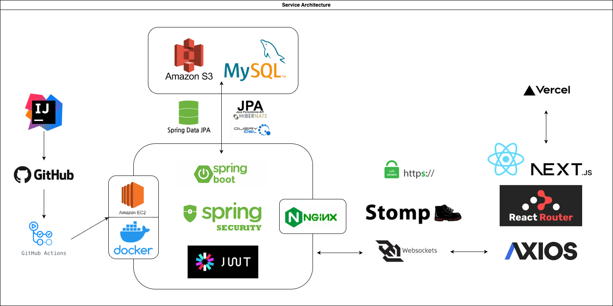

# 🧑‍💻 CODEFLIX 개발자 이러닝 플랫폼

- 개발자 대상 **이러닝 강의 플랫폼**
- **학습자**는 강의 시청 및 코딩 테스트를 통해 학습
- **강사**는 강의 영상을 직접 업로드 하여 강의 제작
- 학습자는 강사 신청을 통해 강사 권한을 획득하고, 강의 업로드 및 운영이 가능

---

# 📝 Summary

개발자 온라인 학습 시장이 성장하면서, 다양한 콘텐츠가 쏟아지고 있지만 기존 이러닝 플랫폼은 개인화 학습 환경 부족, 실시간 소통의 부재 등의 문제점이 있었습니다.

이에 사용자가 원하는 강의를 효율적으로 수강하고, 실시간 소통과 코딩 테스트까지 가능한 **이러닝 플랫폼**을 개발하게 되었습니다.

---

# ⚙️ Function

### 🔐 회원가입 / 로그인 / 계정 관리

- 이메일 인증 기반 회원가입
- 아이디 찾기: 휴대폰 SMS 인증
- 비밀번호 재설정: 이메일 링크 기반
- **소셜 로그인: 구글, 카카오, 깃허브**

---

### 🎓 강의 시청 기능

- 강의는 섹션별로 나뉘며, 여러 개의 강의 영상으로 구성
- 영상 시청 기록 저장 → 나중에 이어보기 가능
- 강의 중 메모 저장, 강사 Q&A 게시글 작성 가능

---

### 💻 코딩 테스트

- **Java, Python, C, JavaScript 기반 문제 풀이**
- 코드 작성 후 답안 제출 → 개인 학습 기록에 저장
- 다른 사용자들의 제출 코드 열람 가능

---

### 🧑‍🤝‍🧑 커뮤니티

- 질문/답변, 팀 프로젝트 모집, 자유게시판 운영
- 게시글, 댓글, 좋아요, 팔로우 기능 포함

---

### 📈 내 학습 관리

- 수강 강의 리스트
- 학습 진도율, 코딩 테스트 진행률, 개인 통계 시각화

---

### 💳 결제 / 장바구니 / 쿠폰

- **KG 이니시스 API를 활용한 결제**
- 장바구니 담기 / 쿠폰 발급 및 적용

---

### 👤 마이페이지 (사용자)

- 대시보드, 구매 내역, 커뮤니티 활동 내역
- 위시리스트(좋아요), 팔로우 관리

---

### 🎓 강사 기능

- 강의 생성, 수정, 관리
- 강의 수익 확인 (엑셀 다운로드 가능)
- 수강생 질문 답변 관리, 수강평 조회
- 강사 대시보드로 통계 확인 및 전체 수익 조회

---

### 💬 실시간 채팅 기능

- 강사 또는 유저를 검색하거나 팔로우한 유저와 채팅 가능
- **다대일 채팅방 생성 및 실시간 소통 가능**

---

### 🛠 관리자 기능

- 회원 목록, 강의 목록 확인
- 강의는 관리자의 승인 이후에 공개됨
- 전체 강의 및 유저 통계 데이터 시각화
- 수익 관리 및 정산 내역 확인
- 쿠폰 발급 및 관리 기능

---

# ⭐️ Key Function!

- **사용자 인증 방식 차별화**:  
  일반 유저는 Zustand로 토큰 저장, 관리자는 HttpOnly 쿠키 방식으로 보안 강화

- **WebSocket(STOMP) 기반 실시간 통신 구조 구현**:  
  각 채팅방은 `/topic/chat/{roomId}` 경로로 구독-발행(Pub/Sub) 방식 처리

- **AWS EC2 서버에 공식 SSL 인증서 적용, 전체 HTTPS 통신 환경 구축**

- **도메인 관리는 AWS Route 53을 사용하여 안정적으로 운영**

---

# 🛠 Tech Stack

- **Backend**: Java, Spring Boot, JPA, Spring Security, JWT
- **Frontend**: Next.js, React, TypeScript
- **Database**: MySQL
- **Infra/DevOps**: AWS (EC2, S3, Route 53), Docker, GitHub Actions
- **Authentication**: OAuth2 (Google, Kakao, GitHub), SMS (CoolSMS), Email 인증
- **Payment**: KG 이니시스 API
- **Chat**: WebSocket (STOMP, SockJS), 실시간 채팅, 읽음 처리

---

# ⚙️ Architecture

---

# 🧑🏻‍💻 Team

- 총 6명의 **풀스택 개발자**로 구성
- 프로젝트는 **기능 단위로 역할을 분담**하여, 각자 맡은 기능에 대해 **프론트엔드와 백엔드를 모두 구현**하는 방식으로 개발을 진행했습니다.

---

# 🌐 Deployment & GitHub

### 🔗 배포 주소  
- [https://your-deployment-domain.com](https://your-deployment-domain.com)

### 💻 GitHub Repository  
- **Frontend**: [https://github.com/your-username/project-frontend](https://github.com/your-username/project-frontend)  
- **Backend**: [https://github.com/your-username/project-backend](https://github.com/your-username/project-backend)
